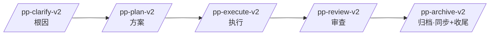

# pp-skills — 一条「人点头」的开发流水线(Claude + Codex)

把「根因 → 方案 → 执行 → 审查 → 归档」固化成 **5 个 slash 技能**(+ `/pp-pipeline` 链路单一信源 · 只读参考),
富内容全进 ppwiki 引擎结构化字段(`task --workflow_get` 唯一数据源),跨会话复用。设计理念见 [COVENANT.md](COVENANT.md)。

## 流水线



| 技能 | 阶段 | 干什么 |
|---|---|---|
| `/pp-clarify-v2` | 根因 | 事实vs判断四分闸(只问人拍的判断)· 决策点 A/B+流程图 · 三件产物进 clarify 字段(set_goal) |
| `/pp-plan-v2` | 方案 | derive_task 派生顶层任务(唯一入口)· 方案进 task.context/plan(§0.0 逻辑定位/架构/五类产出)+ 12 项自审 + 子代理对抗 |
| `/pp-execute-v2` | 执行 | set_subtask 拆子任务串行解锁施工 · 循环跑命令式验收到全绿 · 真实链路非 mock · 产出进子任务字段 |
| `/pp-review-v2` | 审查 | 5 维 hostile 自攻 → 四审 review_subtask_check 逐关封口 + set_final_acceptance + 跨任务回顾 |
| `/pp-archive-v2` | 归档 | 资产入 reusable_code/wiki/decision(幂等)+ task --archive(引擎内部 move) |
| `/pp-pipeline` | 参考 | 链路图 · 命令↔引擎阶段映射 · 富内容↔字段映射 · 所有权(只读单一信源 · 5 技能引用) |

> 富内容贯穿全程进引擎字段:clarify(set_goal/understandings)→ task.context/plan → 子任务(implementation/output/四审)→ final_acceptance;读取一律 `task --workflow_get`。

## 安装

- **让 AI 自动装**:对 Claude/Codex 说「按 INSTALL.md 安装 pp-skills」→ 见 [INSTALL.md](INSTALL.md)
- **一键脚本**:`bash install.sh`(检测 Claude/Codex · 拷 6 技能 · 清旧 v1 + 退役 pp-sync)
- **依赖**:ppwiki MCP — 见 [ppwiki-setup.md](ppwiki-setup.md)

两工具同格式(`~/.<tool>/skills/<name>/SKILL.md`,Agent Skills 开放标准),同一批文件通吃。

## 用法

```
/pp-clarify-v2 <一句话需求>     # 根因澄清,三件产物进 clarify 字段
/pp-plan-v2                     # 派生任务 + 方案进 task.context/plan
/pp-execute-v2 <任务名>         # 拆子任务施工 + 循环验收到全绿
/pp-review-v2 <任务名>          # hostile 四审封口 + 回顾
/pp-archive-v2 <任务名>         # 同步资产入库 + 归档
```

每步结尾给 A/B/C 让你拍板,前一步没点头不进下一步(三段闸门)。
Claude 侧 5 技能默认 `disable-model-invocation`——只你手动喊,AI 不自动触发。

## 设计理念

- **三段闸门**:理解 → 方案 → 实现,前段没点头禁进后段
- **读事实不读记忆**:三源调研 + 证据 file:line 落盘 + 写后验证
- **底层先足量 / 禁缝缝补补 / 单一信源**:见 [COVENANT.md](COVENANT.md) 红线 1-8
- **hostile 自我攻击**:plan 子代理对抗 + review 5 维找茬 + 真实链路测试
