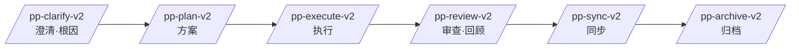

# pp-skills — 一条「人点头」的开发流水线(Claude + Codex)

把「澄清 → 方案 → 执行 → 审查 → 同步 → 归档」固化成 **6 个 slash 技能**,
每阶段产物沉淀进 ppwiki 知识库,跨会话复用。设计理念见 [COVENANT.md](COVENANT.md)。

## 流水线



| 技能 | 阶段 | 干什么 |
|---|---|---|
| `/pp-clarify-v2` | 澄清·根因 | 事实vs判断四分闸(只问人拍的判断)· 决策点 A/B+流程图 · 输出三件产物(原始诉求/澄清后描述/预期效果) |
| `/pp-plan-v2` | 方案 | 3 份 MD(对话和澄清/攻击性验收/五类产出)+ 闸门②硬产出(架构图/底层探测/分层表/影响范围)+ 子代理模拟验证 |
| `/pp-execute-v2` | 执行 | 按五类清单施工 · 循环跑命令式验收到全绿 · 真实链路非 mock · 提交前自检 |
| `/pp-review-v2` | 审查 | 维0 目的达成 + 代码质量 5 维 hostile 自攻 + 真实测试复核 + 跨任务回顾 |
| `/pp-sync-v2` | 同步 | 提资产入 ppwiki wiki/decision · 写后验证 · 证据归集 |
| `/pp-archive-v2` | 归档 | 写任务总结 + 物理归档(mv 后验证) |

> 证据骨架贯穿全程:`.pp/wiki/当前任务/[任务名]/证据/{代码证据,外部证据,执行验收,审查报告}.md`

## 安装

- **让 AI 自动装**:对 Claude/Codex 说「按 INSTALL.md 安装 pp-skills」→ 见 [INSTALL.md](INSTALL.md)
- **一键脚本**:`bash install.sh`(检测 Claude/Codex · 拷 6 技能 · 清旧 v1)
- **依赖**:ppwiki MCP — 见 [ppwiki-setup.md](ppwiki-setup.md)

两工具同格式(`~/.<tool>/skills/<name>/SKILL.md`,Agent Skills 开放标准),同一批文件通吃。

## 用法

```
/pp-clarify-v2 <一句话需求>     # 澄清,锁定三件产物
/pp-plan-v2                     # 产 3 份 MD 方案
/pp-execute-v2 <任务名>         # 施工 + 循环验收到全绿
/pp-review-v2 <任务名>          # hostile 审查 + 回顾
/pp-sync-v2 <任务名>            # 沉淀进 wiki
/pp-archive-v2 <任务名>         # 总结 + 归档
```

每步结尾给 A/B/C 让你拍板,前一步没点头不进下一步(三段闸门)。
Claude 侧 6 技能默认 `disable-model-invocation`——只你手动喊,AI 不自动触发。

## 设计理念

- **三段闸门**:理解 → 方案 → 实现,前段没点头禁进后段
- **读事实不读记忆**:三源调研 + 证据 file:line 落盘 + 写后验证
- **底层先足量 / 禁缝缝补补 / 单一信源**:见 [COVENANT.md](COVENANT.md) 红线 1-8
- **hostile 自我攻击**:plan 子代理对抗 + review 5 维找茬 + 真实链路测试
